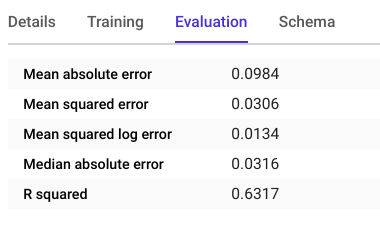
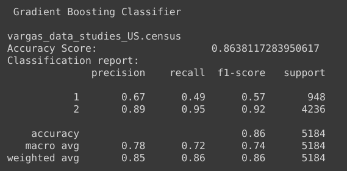
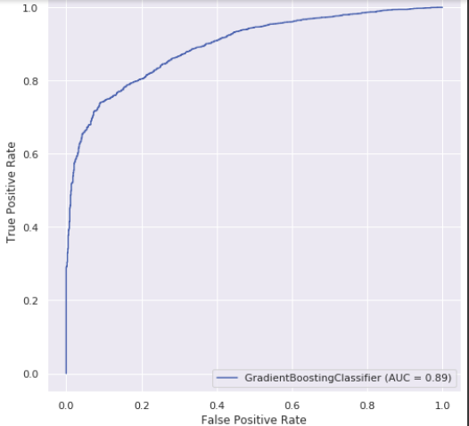
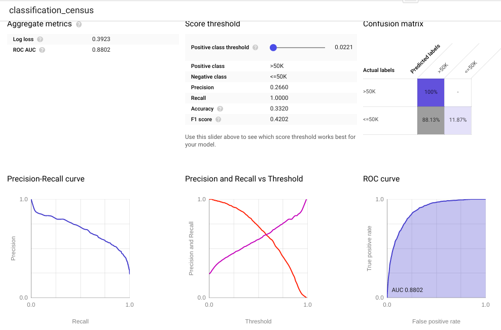

- I am on the process of modifying this repo. At the moment, this is the ketch:

## Personal research about pros and cons of ML with Python, with BigQuery and Google AutoML for markech purposes.

------------------
---------------------

There are 2 cases to compare: Regression and classification algorithms.

    In addition to the final scores, in /src are available the files to create the models with the mentioned tools. 

----------------------
--------------------------

**Python**: My favorite, with really good results, not unusual because the dataset cleaning can be extremely well done and there are almost an infinite number of available algorithms and techniques to play with. 

- The cost is 0€.
- It can take many hours to build a great model.

**BigQuery**: The cleaning process can be quite uncomfortable. In spite of not being the most accurate, its performance can be valid, depending on your goal (four our case of studies, which is Martech it delivers acceptably).

- The cost is very low for our purposes (<1€/job).
- It take less time to build it than Python.
- It can be very easily implemented and programmed to run periodically in the GCS environment.

**AutoML**: Looks like an Excel, with limited room for manoeuvre. 

- The cost is quite high (~20€/job).
- It take almost 0hours to build it and lot of time computing the solution.
- It can be very easily implemented and programmed to run periodically in the GCS environment.

- With Python, once you have your selected model, you can perform a tunning of hyperparameters to sharp even more your algorithm.

- With BigQuery and AutoML, the tunning of hyperparameters is already implemented on the solution. The final result show the metrics, with an interactive button. You can slide the button to enhance the better metrics for your project. 

A very interesting point is that the 3 tools can be combined.

----------------------
--------------------------

# Regression

A comparison of Python, Google Bigquery and Google AutoML  metrics for Machine Learning. 

This is just a test research with a Google Ads table from a private company. The goal is to predict the Conversion Rate column (the probability of a potentially customer finally performing the action we want (buying, visiting a webpage, watching a video... etc)). The Conversion Rate is a probability, a number, for this reason we chose this label and applied a regression algorithm (it can be a classification problem if planned in other way). 

Again, this is just a test, and if customers have Google 360 we can perform really useful and accurate predictions, like all constantly mentioned in GCS webpages.

- **Python**.

After testing many algorithms and hyperparameters, this is the best one:

- **BigQuery**.

BigQuery does not offer such a variety of algorithms to work with.

        In python you can process a dataframe in many ways, regarding columns or rows, get easy displays of all columns to check their structure... This is not so easy with SQL.

- **AutoML**

Selet columns and run.
        

-----------------------------------------------------
----------------

# Classification

For this study we have chosen a public dataset, the `bigquery-public-data.ml_datasets.census_adult_income`.

The goal is to predict if the people make >50k$/year or less. So it is a binary classification with 2 options.

This kind of studies are really useful and can be used to predict purchases: This customer_id will/will not buy?

For this kind of algorithms there are a lot of metrics to take into account, depending on the distribution of data and what is our final goal, so all of them are presented here, and for future problems we will decide which ones fits better our purposes.

Going back to the census, which is a quite clean dataset, this are the final metrics for each Tool:

**Python**.

From all done algorithms (11), this is the selected one:

- BigQuery

        Metrics worse than with Python, but still acceptable. 

- AutoML

        Remember there is available the tunning of hyperparameters (blue circle) to modify the metrics and implement the selected configuration to work with it.

----------------------

# Conclusions:

To conclude, the best metrics are not necessary the best solution. It will depend on customer, amount of data to ingest periodically, kind of cloud storage and requirements. 