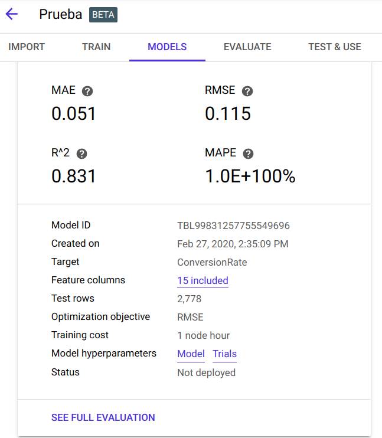
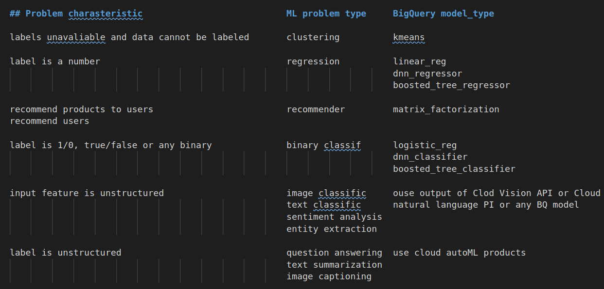

# ml_with_bigquery_personal_notes

This is a sketch of a private company research on what technology could be better to use. Don't panic! Currently in process.

### Evaluating between Python Machine Learning, BigQuery Machine Learning and Google AutoML Machine Learning

- Python

- BigQuery

- Esto está verde. Es un ejemplo

- We need MORE metrics, ROC, AUC ect of ALL systems before being confident with them (RMSE it's just a measure of many), and draw all of them

- We need a deeper cleaning of data before using it (I can clean all perfectly in Python and save it like a new dataset in BigQuery. In that way I'm sure Bigquery ML and AutoML will improve exponentially)

- In the end everything must be imported to google data studio, to have beautiful pony dashboards

-----------------------------------------------------

# 1st things 1st. Basics.

- Regression

    when the label is a number, like estimating the number of tickets that would be sold for a particular movie

- classification

    categorical variables. The probability that a row belongs to a label value.

    - binary classification problems: would buy or wouldn't? 0 or 1
    - multiclass:   the ouput will be a set of probabilities and the sum of them will be 1

- recommender

    it can be done without ml. recommender systems are also the preferable way to address customer targeting problems (to find customers who will like a product or promotional offer)

- clustering

    if we don't have a label at all and we need to do Unsupervised ML

- unstructured data

    we always assume our data consists of structured or semmistructured data. if some of the input features are unstructured (images or natural language text) we should use  Cloud Vision API or Cloud Natural Language 

    ------------------------------------------

    

-------------------------------

