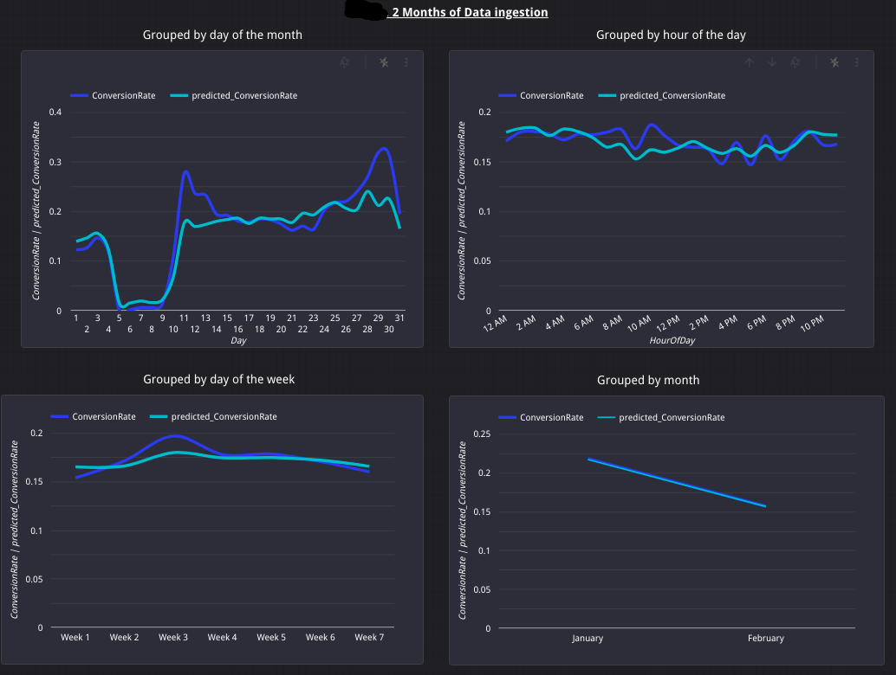

# ML regression with Bigquery

- As an example of regression, I'll predict a column called conversion rate. I didn't pay too much attention to if that was a good stuff to predict, or if the columns I used will be useful to work in real work with this model. The motivation is purely to check how it works.

I already discarded the columns through Python, but we could do something like the following

## Creating the model

        CREATE OR REPLACE MODEL
        `projectid.dataset.tabletoplaywith_vargas_regression` OPTIONS (model_type="linear_reg",
            labels=["ConversionRate"]) AS
        WITH
        params AS (
        SELECT
            1 AS train,
            2 AS eval)
        SELECT
        EXTRACT(DAY
        FROM
            Date) AS Day,
        EXTRACT(dayofweek
        FROM
            Date) AS DayOfWeek,
        EXTRACT(month
        FROM
            Date) AS Month,
        ConversionTrackerId,
        AdNetworkType1,
        AdNetworkType2,
        ConversionAttributionEventType,
        ConversionCategoryName,
        ConversionRate,
        ConversionTypeName,
        ConversionValue,
        CostPerConversion,
        HourOfDay,
        ValuePerConversion
        FROM
        `projectid.dataset.tabletoplaywith`

- In theory, we could use dnn_regressor and boosted_tree_regressor, but Google changed things and they're not available anymore. We'll need to use tensorflow statements

## Evaluate the model

With this we have all metrics. For some reason what google people wants is to minimize the mean_absolute_error. they don't give shit abour r2_score

        SELECT
        *
        FROM
        ML.EVALUATE(MODEL `projectid.dataset.tabletoplaywith_vargas_regression`)

## Prediction

        SELECT
        *
        FROM
        ML.PREDICT(MODEL `projectid.dataset.tabletoplaywith_vargas_regression`,
        (SELECT
        ConversionRate,
        EXTRACT(DAY
                FROM
                    Date) AS Day,
                EXTRACT(dayofweek
                FROM
                    Date) AS DayOfWeek,
                EXTRACT(month
                FROM
                    Date) AS Month,
                ConversionTrackerId,
                AdNetworkType1,
                AdNetworkType2,
                ConversionAttributionEventType,
                ConversionCategoryName,
                ConversionTypeName,
                ConversionValue,
                CostPerConversion,
                HourOfDay,
                ValuePerConversion
        from
        `projectid.dataset.tabletoplaywith`
        ))

## Results

- We've collected data from must 2 months, wich it's not good

1. Grouping by month:
    From 0.25 conversion rate the results start to be different from the desired ones. It really makes no sense to group in this way, unless you have years and years of collected data.

2. Grouping by hours of day

3. Grouping by day of the week. It looks like on wednesday predictions are different from the rest of days (wednesday-thursady).

4. Grouping by month we'll have an awesome prediction. The possible cause could be like locally the predictions are not good, but globally they perform good in the end.

https://datastudio.google.com/u/0/reporting/1awkU_GPtZBy13oRX21c2fIo1NOigrJ9j/page/pgZGB/edit

